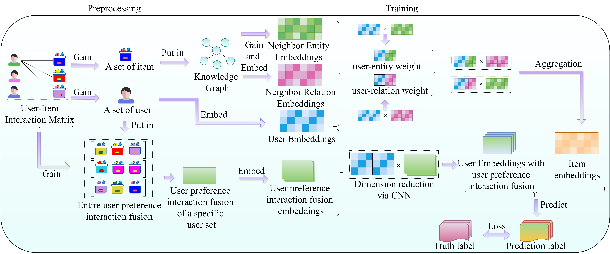

# PIFSA-GNN

# 1.Title

User preference interaction fusion and swap attention graph neural network for recommender system

# 2.Dataset

MovieLens-20M: https://grouplens.org/datasets/movielens/

Dianping-Food: https://www.dianping.com/

Last.FM: https://grouplens.org/datasets/hetrec-2011/

# 3.Code

3.1 Run __main.py__ to train the model.

# 4.Overall framework



# 5.Requirement

This code runs in a Python 3.9.16 environment.

* Torch == 1.13.1 + cu116
* Numpy == 1.23.5
* Pandas == 1.5.3

# 6.Citation

If you want to use our codes in your research, please cite:

```
@article{LI2025107116,
title = {User preference interaction fusion and swap attention graph neural network for recommender system},
journal = {Neural Networks},
pages = {107116},
year = {2025},
issn = {0893-6080},
doi = {https://doi.org/10.1016/j.neunet.2024.107116}
}
```
